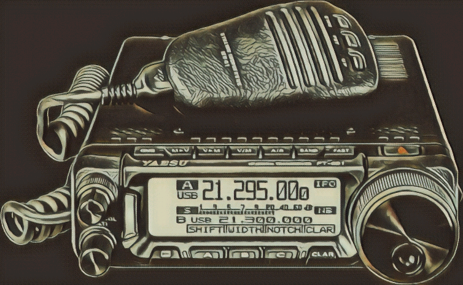

<del><h1 align="center">CPyS-891</h1></del>
<del>

    

</del>

___

## 1) Installation :

`git clone https://github.com/F4JTV/CPyS-891.git ` 
`cd CPyS-891` 
`sudo apt-get install python3-pip` 
`pip install -r requirements.txt` 
`python3 ./CPyS-891.py` 

___

## 2) Usage :

- Edit the CPyS.cfg and change the COM port (Windows) or the /dev/ttyUSB (Linux) and the baudrate folowing your rig.
- The Live Mode will change immediatly the value parameters. If it is disabled, changes on the FT-891 will be applied when you trigger the "Send config to FT-891"
- For now, you can get all the parameters of the menu with "Get config from FT-891" on the menubar.

___

## 3) Dev plan :

- this script is still in developpement, for now, only the Menu of the FT-891 is implemented.

TODO: 
- Menu -> done
- Functions
- Memory
- Reset the rig to default config
- Save and open config files
- Presets for quick config
- About 
- Documentation

## 4) Thanks to contributors for there work and ideas:
PA2EON
